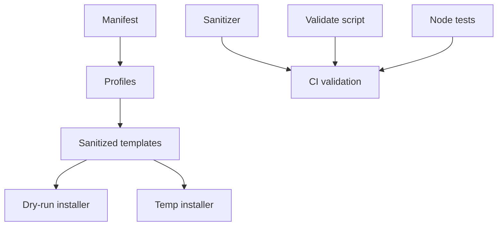
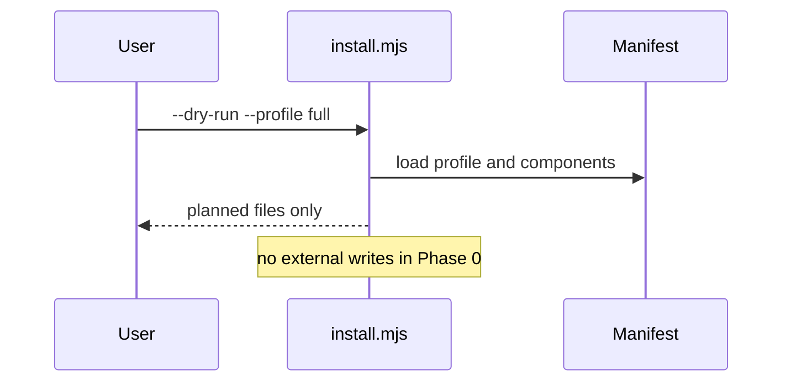
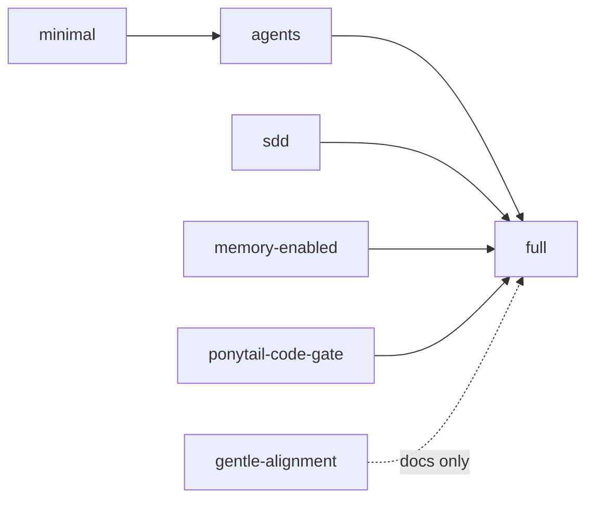
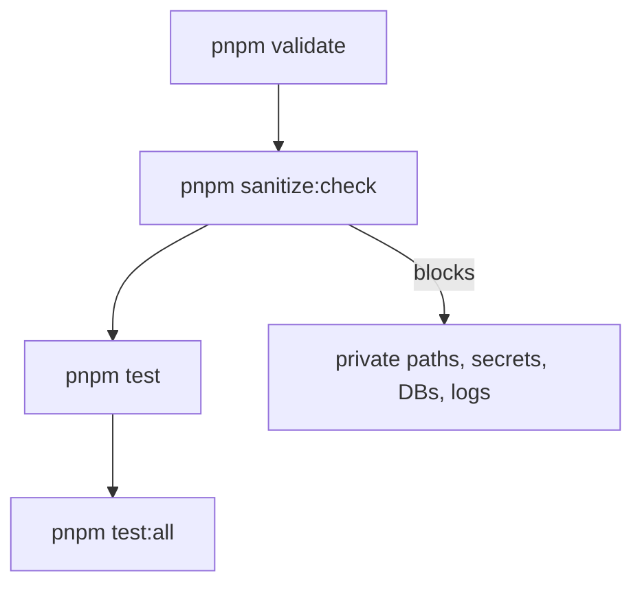

# proyecto-opencode-mem

`proyecto-opencode-mem` is a sanitized, installable OpenCode runtime kit bootstrap. It turns a documented local architecture into portable templates, profiles, scripts, tests, and clear governance without copying private runtime state.

> **Safety baseline:** this repo does **not** copy your real runtime. It creates a testable kit that can later install reviewed templates.

## What problem it solves

OpenCode setups with Manager routing, SDD agents, memory governance, skills, and plugins can become hard to replicate safely. This kit makes the architecture portable by using placeholders, declarative profiles, dry-run installation, sanitizer checks, and tests.

## What it installs later

- Manager and SDD agent templates.
- OpenCode config examples.
- Engram memory governance templates.
- Ponytail Code Gate guidance.
- gentle-ai alignment-only documentation.
- Validation, sanitizer, and dry-run install scripts.

## What it never installs by default

- Real memory databases.
- Real logs, backups, tokens, `.env` files, or personal config.
- Personal OpenCode config.
- gentle-ai runtime.
- Ponytail plugin runtime.
- Anything outside the repo during Phase 0, except temp test output under `tests/tmp`.

## Profiles

| Profile | Purpose | Runtime boundary |
|---|---|---|
| `minimal` | Base docs and templates | No runtime install |
| `agents` | Manager template and governance | No private config |
| `sdd` | SDD templates and routing contracts | No gentle-ai runtime |
| `memory-enabled` | Engram governance and Noise Gate templates | No real DB |
| `ponytail-code-gate` | Code-task guidance | No Ponytail plugin by default |
| `gentle-alignment` | gentle-ai patterns as documentation | No runtime |
| `full` | Manager + SDD + memory governance + Ponytail guidance + harness | No private runtime |

## Quickstart

```bash
corepack enable
pnpm install
pnpm test:all
pnpm install:dry-run -- --profile full
pnpm install:temp
```

## Dry-run installation

`pnpm install:dry-run -- --profile full` reads the manifest and prints what would be copied. It does not write outside the repository.

## Temporary install

`pnpm install:temp` copies selected kit files into `tests/tmp/install-temp`. It never touches the real home directory or OpenCode config directory.

## Architecture



## Dry-run flow



## Profile composition



## Sanitizer and test pipeline



## Manager

The Manager is the single primary orchestrator: it classifies requests, routes work, governs context, delegates SDD phases, coordinates memory, and synthesizes final answers.

## SDD

The kit includes template subagents for `sdd-init`, `sdd-explore`, `sdd-propose`, `sdd-spec`, `sdd-design`, `sdd-tasks`, `sdd-apply`, `sdd-verify`, `sdd-archive`, and `sdd-onboard`. Each template includes `SUBAGENT_RESULT`; `sdd-init` also includes `SDD_INIT_PACKET`.

## Engram memory governance

The memory-enabled profile documents Engram configuration patterns but excludes real databases and memories. See `docs/memory-governance.md`.

## Ponytail guidance

Ponytail is guidance-only in Phase 0. The kit documents the Code Gate but does not install Ponytail plugins by default.

## gentle-ai alignment-only

gentle-ai is treated as an architectural alignment reference, not as a runtime dependency.

## Tests

```bash
pnpm doctor
pnpm validate
pnpm sanitize:check
pnpm test
pnpm test:all
```

## Roadmap

1. Phase 0: bootstrap sanitized kit foundation.
2. Phase 1: import reviewed sanitized components.
3. Phase 2: real installer with explicit user approval.
4. Phase 3: release candidate and cross-machine verification.
