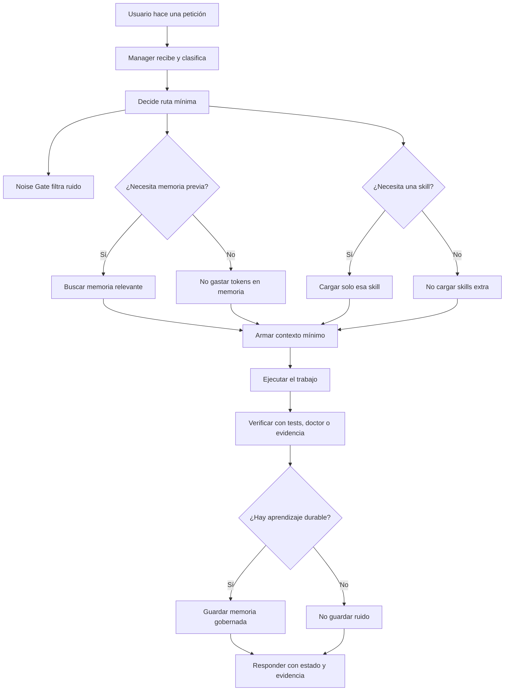
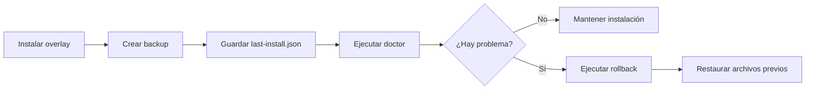

# Arquitectura Codex

Esta guía explica la arquitectura nueva de Codex en español. Primero está escrita para **personas no técnicas**: la idea es que cualquiera entienda qué cambió, por qué mejora la memoria y por qué ahorra tokens. Después viene la **Vista técnica** con archivos, scripts, flujos y validación.

Cuando este documento dice **Codex normal**, se refiere a abrir Codex sin este overlay de usuario, sin el Manager de este kit y sin estas skills instaladas. Cuando dice **Codex con esta arquitectura**, se refiere a Codex usando los archivos instalados por este repositorio dentro de `<CODEX_HOME>`.

---

## 1. Para personas no técnicas: qué problema resuelve

Imaginá que Codex es una persona que te ayuda a trabajar en proyectos.

Un **Codex normal** puede leer lo que le das en la conversación y usar sus herramientas disponibles, pero no siempre tiene una forma ordenada de decidir:

- qué recordar para el futuro;
- qué ignorar porque es ruido;
- qué herramienta usar;
- qué documentación cargar;
- cuándo no cargar cosas para no gastar tokens;
- cómo dejar evidencia de que algo quedó bien;
- cómo volver atrás si una instalación salió mal.

**Codex con esta arquitectura** trabaja más parecido a un equipo organizado:

- tiene un **Manager**, que actúa como coordinador principal;
- tiene **skills**, que son especialistas que se cargan solo cuando hacen falta;
- tiene reglas de **memoria**, para recordar decisiones útiles y no guardar basura;
- tiene un **Noise Gate**, que funciona como filtro para quitar ruido antes de convertir una conversación en memoria;
- tiene control de **tokens**, para no llenar el contexto con documentos que no ayudan;
- tiene **doctor**, tests y rollback para validar y deshacer cambios.

La diferencia simple es esta:

> Codex normal responde con lo que tiene a mano. Codex con esta arquitectura primero ordena la petición, decide qué necesita, carga lo mínimo útil, trabaja, verifica y recién ahí responde con evidencia.

### Modelo mental

Pensalo como una oficina:

| Elemento | Explicación simple |
| --- | --- |
| Usuario | La persona que pide algo. |
| Manager | El coordinador que decide qué especialista llamar. |
| Skill | Un especialista: memoria, tokens, commits, seguridad, SQL, documentación, etc. |
| Memoria | Un cuaderno de decisiones importantes, no un basurero de chats. |
| Noise Gate | Un portero que no deja entrar ruido al cuaderno. |
| Tokens | El espacio de la mesa de trabajo. Si pones demasiado encima, se trabaja peor. |
| Doctor | Una inspección automática para comprobar que la instalación funciona. |
| Rollback | El plan para volver atrás sin romper Codex. |

---

## 2. La idea central: menos ruido, más criterio

El objetivo no es hacer Codex más complejo por gusto. El objetivo es que piense con más orden.

Antes, el riesgo era cargar demasiadas instrucciones, demasiados archivos y demasiados recuerdos. Eso parece útil, pero en la práctica puede causar:

- respuestas confundidas por información vieja;
- memoria llena de frases como “ok”, “dale” o “seguí”;
- más tokens gastados sin aportar razonamiento;
- dificultad para saber qué archivo controla cada comportamiento;
- instalaciones frágiles que se pierden con actualizaciones.

La arquitectura nueva mejora eso con una regla sencilla:

> Cargar solo lo que sirve para la petición actual y guardar solo lo que sirve para una petición futura.

---

## 3. Flujo completo de una petición

Este es el flujo de alto nivel cuando el usuario pide algo:



Explicación en palabras:

1. El usuario pide algo.
2. El Manager decide si es una pregunta simple, una tarea de código, una auditoría, una instalación, una validación o una tarea grande.
3. Si hay ruido, el Noise Gate lo descarta para memoria.
4. Si hace falta contexto pasado, se busca memoria concreta.
5. Si hace falta conocimiento especializado, se carga una skill concreta.
6. Se trabaja con el contexto mínimo necesario.
7. Se verifica antes de afirmar que está listo.
8. Solo si quedó una decisión, descubrimiento, preferencia o configuración útil, se guarda memoria.

---

## 4. Qué es la memoria en esta arquitectura

Memoria no significa “guardar todo el chat”. Memoria significa guardar conocimiento útil para que una sesión futura no empiece desde cero.

Una buena memoria responde:

- qué se decidió;
- por qué se decidió;
- dónde se aplicó;
- qué evidencia lo prueba;
- cuándo debería recuperarse.

Una mala memoria guarda cosas como:

- “ok”;
- “sí”;
- “seguí”;
- un log enorme sin resumen;
- una hipótesis que no se validó;
- una copia completa de una conversación;
- secretos o credenciales;
- información duplicada.

Por eso la mejora importante no es solo “tener memoria”. La mejora es tener **memoria gobernada**.

---

## 5. Archivos de memoria y archivos relacionados

Estos son los lugares que la arquitectura diferencia. No todos son “memoria semántica”; algunos son instrucciones, otros historial y otros evidencia.

| Lugar | Qué es | Para qué sirve | Riesgo si se usa mal |
| --- | --- | --- | --- |
| `<CODEX_HOME>/AGENTS.md` | Instrucciones durables del Manager | Define cómo debe coordinar Codex en ese entorno | Si crece demasiado, gasta tokens siempre. |
| `<CODEX_HOME>/.atl/skill-registry.md` | Registro de skills | Le dice al Manager qué especialistas existen y cuándo usarlos | Si está desactualizado, puede no cargar la skill correcta. |
| `<CODEX_HOME>/skills/opencode-runtime-kit/*/SKILL.md` | Skills instaladas | Guardan procedimientos especializados | Si se cargan todas siempre, desperdician tokens. |
| `<CODEX_HOME>/.opencode-kit/last-install.json` | Metadatos de instalación | Registra qué se instaló y qué backup corresponde | Sin esto, rollback sería menos confiable. |
| `<CODEX_HOME>/.opencode-kit-backups/<backup-id>` | Backups del overlay anterior | Permite volver atrás | Si se borra, no se puede restaurar esa versión. |
| Engram observations | Memoria semántica | Decisiones, bugs, preferencias, hallazgos y resúmenes útiles | Si se guarda ruido, contamina el futuro. |
| Engram user prompts | Captura de prompts | Puede dar contexto reciente | Sin Noise Gate puede llenarse de ruido. |
| Session summaries | Resumen de sesión | Ayuda a continuar después de cerrar o compactar | Si no se hace, la próxima sesión pierde continuidad. |
| `sessions/`, índices y bases internas de Codex | Historial/runtime | Ayuda al motor de Codex a manejar sesiones | No debería tratarse como fuente principal de arquitectura. |
| `README_CODEX.md` y `docs/*` | Documentación versionada | Explica la arquitectura para humanos y QA | Si no se actualiza, la documentación queda vieja. |

La regla práctica es:

> Las decisiones importantes van a memoria gobernada o documentación versionada. Las instrucciones permanentes van a `AGENTS.md` o skills. El historial bruto no debe reemplazar una memoria bien escrita.

---

## 6. Noise Gate: qué es y por qué quita ruido

El **Noise Gate** viene de la arquitectura de OpenCode auditada en este proyecto. En OpenCode se diseñó como una capa cercana a la captura automática de prompts de Engram. Su objetivo es clasificar cada mensaje del usuario antes de guardarlo.

Clasificaciones principales:

| Tipo | Ejemplo | Qué hace la arquitectura |
| --- | --- | --- |
| `instruction` | “Implementa esta mejora y valida con tests” | Puede guardarse si contiene una decisión o patrón reusable. |
| `question` | “¿Cómo funciona la memoria?” | Normalmente se responde; solo se guarda si revela una preferencia o estado durable. |
| `confirmation` | “ok”, “dale”, “sí” | No se guarda salvo que incluya contenido nuevo. |
| `navigation` | “mostrame ese archivo” | Normalmente no se guarda porque es transitorio. |
| `noise` | mensajes vacíos, repetidos o sin valor futuro | No se guarda. |

En palabras simples: el Noise Gate es como un filtro de agua. No crea el agua, pero evita que pasen sedimentos.

### Relación con OpenCode

La arquitectura de OpenCode propone un Noise Gate heurístico, sin depender del LLM, con baja latencia y conservador por defecto. Esa idea se trae a Codex como una skill portable llamada `noise-gate`.

Diferencia importante:

- En OpenCode, el Noise Gate puede vivir cerca de un hook de captura automática.
- En este kit de Codex, el Noise Gate existe como regla portable de Manager/memoria/summary. No afirmamos que Codex tenga el mismo hook interno de OpenCode. Si más adelante Codex expone un hook compatible, esta lógica se puede convertir en control automático.

Esto hace que la arquitectura tenga sentido con OpenCode sin copiar a ciegas piezas que pertenecen a otro runtime.

---

## 7. Tokens: explicación simple

Los tokens son el espacio de trabajo del modelo. Cada archivo, regla, memoria y herramienta que se carga ocupa parte de ese espacio.

Si al modelo le cargas todo siempre, pasa algo parecido a poner todos los documentos de una empresa sobre una mesa pequeña: hay mucha información, pero trabajar se vuelve más difícil.

La mejora de tokens consiste en:

1. mantener el Manager corto;
2. cargar skills solo cuando correspondan;
3. buscar memoria solo si la petición depende del pasado;
4. leer documentación por secciones útiles;
5. usar context packs para tareas grandes;
6. medir el peso de documentos y skills con reportes.

Resultado esperado:

- menos contexto fijo;
- menos memoria irrelevante;
- menos ruido histórico;
- respuestas más enfocadas;
- más espacio para razonar sobre el problema real.

---

## 8. Vista técnica: componentes instalados

La instalación de Codex no modifica carpetas administradas por actualizaciones de la aplicación. Usa un overlay dentro de `<CODEX_HOME>`.

Componentes principales:

| Componente | Archivo o carpeta | Rol |
| --- | --- | --- |
| Manager | `templates/codex/AGENTS.codex.example.md` instalado como `<CODEX_HOME>/AGENTS.md` | Orquestador principal. |
| Registro de skills | `.atl/skill-registry.md` | Índice portable generado desde `skills/*/SKILL.md`. |
| Skills core | `skills/manager-router`, `skills/memory-governance`, `skills/noise-gate`, `skills/context-pack-builder`, `skills/token-budgeter` | Routing, memoria, ruido, contexto y tokens. |
| Skills importadas de OpenCode | `skills/work-unit-commits`, `skills/chained-pr`, `skills/branch-pr`, etc. | Buenas prácticas portables migradas desde la auditoría. |
| Instalador Codex | `scripts/install-codex-overlay.mjs` | Copia overlay y crea backup previo. |
| Rollback Codex | `scripts/rollback-codex-overlay.mjs` | Restaura backup o elimina archivos instalados. |
| Doctor Codex | `scripts/codex-doctor.mjs` | Valida que el overlay instalado tenga lo mínimo necesario. |
| Lint de memoria | `scripts/memory-lint.mjs` | Detecta memoria con mal formato, sin evidencia o riesgosa. |
| Reporte de tokens | `scripts/token-budget-report.mjs` | Mide archivos grandes y ayuda a decidir lazy loading. |
| Context pack check | `scripts/context-pack-check.mjs` | Verifica que un paquete de contexto sea mínimo y justificable. |

---

## 9. Auditoría OpenCode

La auditoría OpenCode mostró que la arquitectura original ya tenía ideas buenas:

- Manager como orquestador principal;
- Engram para memoria persistente;
- Noise Gate para reducir prompts ruidosos;
- SDD y subagentes para cambios grandes;
- skills especializadas;
- foco en reducción de tokens;
- separación entre documentos versionados, memoria y runtime.

Lo que se hizo para Codex no fue copiar todo. Se migró lo que tenía sentido de forma portable.

| De OpenCode | Decisión para Codex |
| --- | --- |
| Manager | Mantenerlo como coordinador principal en `AGENTS.md`. |
| Noise Gate | Convertirlo en skill portable y regla de memoria. |
| Skills útiles | Migrarlas como `skills/opencode-runtime-kit/*`. |
| Plugins TypeScript de OpenCode | No copiarlos directo porque pertenecen a otro runtime. |
| Configs con MCP o secretos | No copiarlas para evitar fuga de credenciales y errores. |
| Documentación de memoria/tokens | Transformarla en README, skills y scripts verificables. |

Punto clave:

> La mejora no es “hacer que Codex sea OpenCode”. La mejora es traer a Codex los contratos buenos de OpenCode sin romper la seguridad, la portabilidad ni las actualizaciones.

---

## 10. Puntos de mejora

Estos son los puntos concretos que mejora la arquitectura:

1. **Update-safety**: no se edita la carpeta instalada de Codex ni OpenCode; se usa overlay de usuario.
2. **Manager claro**: hay un orquestador principal en vez de reglas dispersas.
3. **Memoria gobernada**: se guarda lo útil, con evidencia, y se evita ruido.
4. **Noise Gate**: se filtran confirmaciones, navegación y mensajes sin valor futuro.
5. **Uso de tokens**: se carga menos contexto fijo y más contexto bajo demanda.
6. **Skills lazy-loaded**: cada especialista vive separado y se invoca solo si hace falta.
7. **Validación repetible**: tests, doctor, sanitizer, docs check y token report.
8. **Rollback**: cada instalación real guarda backup para deshacer.
9. **Replicabilidad**: el repo contiene scripts y documentación para instalar en otro entorno.
10. **Seguridad**: no se migran secretos ni MCP privados sin contrato explícito.

---

## 11. Qué se mejoró y cómo se evidencia

| Mejora | Cómo lo mejora | Evidencia en el repo |
| --- | --- | --- |
| README en español para principiantes | Explica primero con analogías y después con técnica | `README_CODEX.md` y `tests/unit/readme-codex.test.mjs` |
| Noise Gate portable | Agrega una skill de clasificación antes de guardar memoria | `skills/noise-gate/SKILL.md` |
| Instalación update-safe | Copia solo a `<CODEX_HOME>` y rechaza carpetas administradas | `scripts/install-codex-overlay.mjs` |
| Rollback | Guarda backup y metadata de instalación | `scripts/rollback-codex-overlay.mjs` |
| Doctor | Revisa que el overlay instalado tenga archivos esperados | `scripts/codex-doctor.mjs` |
| Registro de skills | Genera índice portable sin rutas privadas | `scripts/skill-registry-generate.mjs` y `.atl/skill-registry.md` |
| Memoria con calidad | Lint para formato, evidencia y riesgos | `scripts/memory-lint.mjs` |
| Tokens controlados | Reporte para ver archivos pesados | `scripts/token-budget-report.mjs` |
| Contexto mínimo | Valida que cada archivo incluido tenga razón | `scripts/context-pack-check.mjs` |
| Migración desde OpenCode | Documenta qué se copió, qué no y por qué | `docs/codex-opencode-gap-audit.md` |

---

## 12. Cómo usarlo

### 12.1 Validar el overlay instalado

```powershell
pnpm codex:doctor -- --target "$env:USERPROFILE\.codex"
```

Si tu terminal todavía no reconoce `pnpm`, abre una nueva terminal o usa el ejecutable de pnpm instalado en el perfil de usuario.

### 12.2 Hacer una instalación de prueba

```powershell
pnpm install:codex:dry-run -- --target "$env:USERPROFILE\.codex"
```

Esto muestra qué se copiaría, sin escribir archivos.

### 12.3 Instalar el overlay

```powershell
node scripts/install-codex-overlay.mjs --target "$env:USERPROFILE\.codex"
```

### 12.4 Validar rollback sin ejecutar cambios

```powershell
pnpm rollback:codex:dry-run -- --target "$env:USERPROFILE\.codex"
```

### 12.5 Volver atrás

```powershell
pnpm rollback:codex -- --target "$env:USERPROFILE\.codex"
```

### 12.6 Medir tokens

```powershell
pnpm tokens:report
```

### 12.7 Regenerar registro de skills

```powershell
pnpm skills:registry
```

---

## 13. Cómo pedirle trabajo a Codex con esta arquitectura

Ejemplos útiles:

```text
Usa manager-router para clasificar esta petición y cargar solo la skill necesaria.
```

```text
Aplica memory-governance antes de guardar memoria: guarda solo decisiones, bugs, preferencias o hallazgos con evidencia.
```

```text
Aplica noise-gate: clasifica este mensaje como instruction, question, confirmation, navigation o noise antes de guardarlo.
```

```text
Usa token-budgeter y dime qué archivos conviene cargar bajo demanda para gastar menos tokens.
```

```text
Construye un context pack mínimo para esta tarea y justifica cada archivo incluido.
```

```text
Usa work-unit-commits para dividir este cambio en commits revisables con tests.
```

---

## 14. Estado actual

Estado de implementación en esta rama:

- El overlay Codex existe y se instala en `<CODEX_HOME>`.
- El instalador hace backup antes de sobrescribir archivos.
- El rollback existe.
- El doctor existe.
- El README de Codex está en español y tiene contrato de test.
- La skill `noise-gate` fue agregada al kit portable.
- El manifiesto incluye el Noise Gate dentro de `codex-skills`.
- El registro de skills se puede regenerar.
- OpenCode fue auditado como fuente arquitectónica, pero no se modificó su carpeta de aplicación.

Pendiente o futuro:

- Convertir Noise Gate en hook automático si Codex ofrece un punto de extensión compatible.
- Crear dashboard de calidad de memoria para medir ruido real vs memoria útil.
- Crear comandos de alto nivel estilo catálogo si se quiere experiencia tipo slash commands.
- Hacer una segunda etapa para OpenCode con contratos equivalentes, sin copiar secretos ni rutas locales.

---

## 15. Rollback

Rollback significa volver al estado anterior si el overlay no queda como esperabas.

Flujo:



Primero se prueba:

```powershell
pnpm rollback:codex:dry-run -- --target "$env:USERPROFILE\.codex"
```

Después, si realmente querés volver atrás:

```powershell
pnpm rollback:codex -- --target "$env:USERPROFILE\.codex"
```

---

## 16. Vista técnica: por qué es mejor que cargar todo siempre

La arquitectura separa contexto por capas:

1. **Core de Codex**: lo que trae el producto.
2. **Manager**: instrucciones mínimas de coordinación.
3. **Memoria recuperada**: solo cuando la tarea depende del pasado.
4. **Documentación versionada**: fuente humana de verdad, leída bajo demanda.
5. **Skills**: procedimientos especializados, lazy-loaded.
6. **Herramientas y MCP**: se activan por necesidad, no por costumbre.
7. **Scripts de validación**: pruebas determinísticas para no depender de intuición.

Esto es mejor porque reduce el costo fijo. Un Codex sin overlay puede depender más de lo que haya en el prompt o de reglas cargadas manualmente. Codex con esta arquitectura tiene una ruta estable para decidir qué cargar, qué ignorar, qué recordar y cómo verificar.

---

## 17. Cómo validar que funciona

Ejecuta estas validaciones desde el repositorio:

```powershell
node --test tests/unit/readme-codex.test.mjs
```

```powershell
pnpm test:all
```

```powershell
node scripts/codex-doctor.mjs --target "$env:USERPROFILE\.codex"
```

```powershell
pnpm rollback:codex:dry-run -- --target "$env:USERPROFILE\.codex"
```

Qué prueba cada una:

| Comando | Qué demuestra |
| --- | --- |
| `node --test tests/unit/readme-codex.test.mjs` | Que este README explica lo pedido y sigue siendo portable. |
| `pnpm test:all` | Que validación, sanitizer, docs y tests pasan juntos. |
| `codex-doctor` | Que el overlay instalado en Codex tiene los archivos esperados. |
| `rollback:codex:dry-run` | Que existe un plan de reversa antes de tocar nada. |

---

## 18. Regla final para mantener la arquitectura sana

Usa esta regla cada vez que quieras agregar algo nuevo:

- Si debe estar siempre presente, ponlo corto en Manager.
- Si sirve para un tipo de trabajo, ponlo en una skill.
- Si debe comprobarse de forma mecánica, ponlo en un script.
- Si es historia útil del proyecto, guárdalo como memoria gobernada.
- Si es explicación humana o arquitectura, ponlo en documentación versionada.
- Si es ruido, no lo guardes.

Esa es la diferencia principal: Codex deja de depender de “recordar todo” y empieza a operar con una arquitectura de decisión, memoria y tokens.
