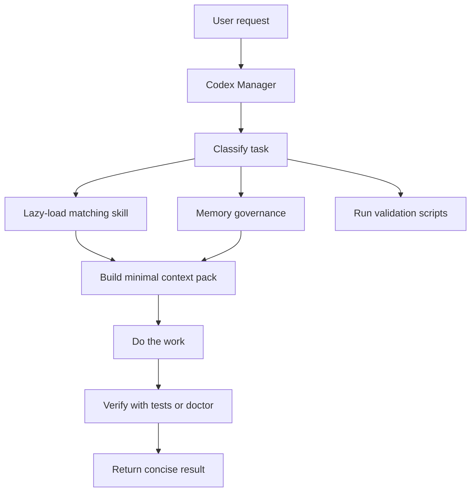
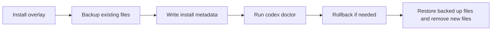

# Codex Runtime Architecture

This document explains the new Codex-first architecture in two layers:

1. **Beginner model**: what problem it solves and how to use it.
2. **Technical model**: how Manager, skills, memory, tokens, scripts, subagents, and rollback fit together.

The short version: **Codex starts with a small Manager, then loads only the specialist skill or script needed for the task.**

---

## 1. Beginner model

Imagine Codex as a construction site.

- **Manager** is the foreman.
- **Skills** are specialists: security, docs, memory, tokens, PRs, SQL, UI review.
- **Memory** is the project notebook.
- **Context packs** are the small folder of drawings you bring to one meeting.
- **Token budget** is the size of the meeting table: if you bring every drawing, nobody can think clearly.
- **Doctor scripts** are inspections.
- **Rollback** is the undo plan if the installation is wrong.

The old risk was this:

> Put too many rules in the main prompt and hope the model remembers everything.

The new design is this:

> Keep the main prompt small. Route to the right skill. Pull only the needed memory. Validate before and after writes.

That is the same principle as good software architecture: **small entrypoint, clear modules, explicit contracts.**

---

## 2. What changed vs the OpenCode architecture

The OpenCode architecture already had valuable ideas:

- Manager as primary orchestrator.
- SDD phases.
- Engram memory.
- Noise Gate concepts.
- Token reduction plans.
- subagent delegation.
- skills and MCP maps.

The Codex proposal turns those ideas into an update-safe, installable kit:

| Concern | OpenCode architecture | Codex runtime kit |
| --- | --- | --- |
| Primary agent | Manager concept in OpenCode config | Manager contract installed into `<CODEX_HOME>/AGENTS.md` |
| Skills | Many local OpenCode skills | Portable Codex skills under `skills/opencode-runtime-kit` |
| Memory | Engram and prompt-capture policies | `memory-governance` skill plus linting and context-pack rules |
| Tokens | Token reduction docs | `token-budgeter` skill plus `tokens:report` script |
| Install | Runtime-specific config | Explicit-target overlay installer |
| Safety | Documented | Backup-before-overwrite, doctor, sanitizer, rollback |
| Updates | Risk if app folders are edited | User-owned overlay only |

The important architecture decision is this:

> Codex improvements live in user-owned overlay folders, not in app install folders.

That means Codex or OpenCode updates should not overwrite this kit.

---

## 3. Current state

Implemented:

- Codex overlay installer.
- Codex doctor.
- Codex rollback script.
- Real backup before overwriting overlay targets.
- pnpm installed in the user profile, not in an application install directory.
- OpenCode-to-Codex skill bridge.
- OpenCode adaptation plan.
- Context-pack validator.
- Memory lint.
- Token budget report.
- Skill registry generator.
- `README_CODEX.md`.
- OpenCode gap audit at `docs/codex-opencode-gap-audit.md`.

Installed into Codex:

- `AGENTS.md`
- `.atl/skill-registry.md`
- `skills/opencode-runtime-kit/*`

Not installed by design:

- OpenCode TypeScript plugins.
- OpenCode app-folder changes.
- Codex app-folder changes.
- Node/Corepack global shims in managed install folders.
- MCP configs with embedded secrets.

---

## 4. Technical model



### Manager

Manager is the only primary orchestrator. It should:

1. understand the user request;
2. avoid loading every rule at once;
3. choose a skill or script;
4. retrieve memory only when useful;
5. delegate only when needed and allowed;
6. verify before claiming completion.

### Skills

Skills are small, lazy-loaded instruction modules. They keep the main prompt short.

Core kit skills:

- `manager-router`
- `memory-governance`
- `context-pack-builder`
- `token-budgeter`

Imported OpenCode-inspired skills:

- `work-unit-commits`
- `chained-pr`
- `branch-pr`
- `issue-creation`
- `judgment-day`
- `deploy-security-gate`
- `cognitive-doc-design`
- `flow-diagram`
- `web-design-guidelines`
- `skill-improver`
- `bigquery-table-cleaning`
- `sandbox-data-loader`
- `sql-learning`

### Memory

Memory is useful only when governed.

Good memory:

- has a clear title;
- explains what changed and why;
- includes evidence;
- avoids raw prompt dumps;
- avoids secrets;
- uses stable topic keys for evolving decisions.

Bad memory:

- duplicates old facts;
- saves every tiny confirmation;
- stores private keys or tokens;
- lacks evidence;
- pollutes future context.

### Tokens

Tokens are the working memory of the model. The goal is not to use zero tokens; the goal is to spend them where they help reasoning.

The architecture saves tokens by:

1. keeping `AGENTS.md` short;
2. moving detail into skills;
3. loading docs only when relevant;
4. using context packs;
5. measuring large docs with `tokens:report`;
6. avoiding duplicated memory.

### Subagents

OpenCode has explicit SDD subagents. Codex can use subagents when delegation is available and appropriate.

The portable rule is:

- Manager stays primary.
- Subagents get a narrow task.
- Subagents receive exact skill paths.
- Subagents return compact results.
- Manager verifies before accepting.

### MCP and plugins

MCPs and plugins are powerful, but expensive and risky if always-on.

The Codex kit uses this rule:

> Activate tools by task, not by habit.

Examples:

- Need current library docs? Use documentation tooling.
- Need UI verification? Use browser or Playwright tooling.
- Need memory? Use Engram.
- Need GitHub? Use GitHub tooling.
- Need none of those? Do not load them.

---

## 5. How to use it

### Validate the installed Codex overlay

```powershell
pnpm codex:doctor -- --target "$env:USERPROFILE\.codex"
```

### Dry-run install

```powershell
pnpm install:codex:dry-run -- --target "$env:USERPROFILE\.codex"
```

### Install overlay

```powershell
node scripts/install-codex-overlay.mjs --target "$env:USERPROFILE\.codex"
```

### Dry-run rollback

```powershell
pnpm rollback:codex:dry-run -- --target "$env:USERPROFILE\.codex"
```

### Roll back last install

```powershell
pnpm rollback:codex -- --target "$env:USERPROFILE\.codex"
```

### Token report

```powershell
pnpm tokens:report
```

### Memory lint

```powershell
pnpm memory:lint -- tests/fixtures/memory-lint
```

### Generate skill registry

```powershell
pnpm skills:registry
```

---

## 6. Example prompts

### Use Manager routing

```text
Use manager-router to classify this task and load only the necessary skill.
```

### Use memory governance

```text
Before answering, apply memory-governance: search relevant context, avoid duplicate memory, and do not save raw prompts.
```

### Use token budgeting

```text
Use token-budgeter and tell me which files should be lazy-loaded instead of placed in the initial context.
```

### Use context packs

```text
Build a minimal context pack for this bug before editing files.
```

### Use work-unit commits

```text
Use work-unit-commits and split this implementation into reviewable commits with tests.
```

### Use judgment day

```text
Use judgment-day to run an adversarial review of this diff before I merge it.
```

---

## 7. Rollback

Every real Codex install creates backup metadata.

Rollback flow:



Use dry-run first:

```powershell
pnpm rollback:codex:dry-run -- --target "$env:USERPROFILE\.codex"
```

Then real rollback:

```powershell
pnpm rollback:codex -- --target "$env:USERPROFILE\.codex"
```

---

## 8. OpenCode audit summary

See the full audit in:

```text
docs/codex-opencode-gap-audit.md
```

Main result:

- useful OpenCode skills were converted into portable Codex kit skills;
- OpenCode plugin runtimes were not copied directly;
- MCP configs with possible secrets were not copied;
- update-managed folders were not modified;
- Codex now has a safer subset of the OpenCode architecture.

This is the right tradeoff. Copying everything blindly feels fast, but it creates a fragile system. A senior architecture migrates the **concepts and contracts**, not random machine-specific files.

---

## 9. Maintenance checklist

Before changing the Codex runtime kit:

1. Add or update a test first.
2. Run `pnpm test:all`.
3. Run `pnpm codex:doctor -- --target "$env:USERPROFILE\.codex"` after install.
4. Run `pnpm tokens:report` if docs or skills grew.
5. Avoid absolute local paths in committed files.
6. Do not commit secrets.
7. Keep Manager short.
8. Move deep behavior into skills or scripts.

---

## 10. Mental model for future work

If a rule is always needed, put a short version in Manager.

If a rule is specific to one task type, put it in a skill.

If a rule must be checked by a machine, put it in a script.

If a rule is historical context, put it in memory.

If a rule is big and rarely needed, lazy-load it.

That is the architecture.
