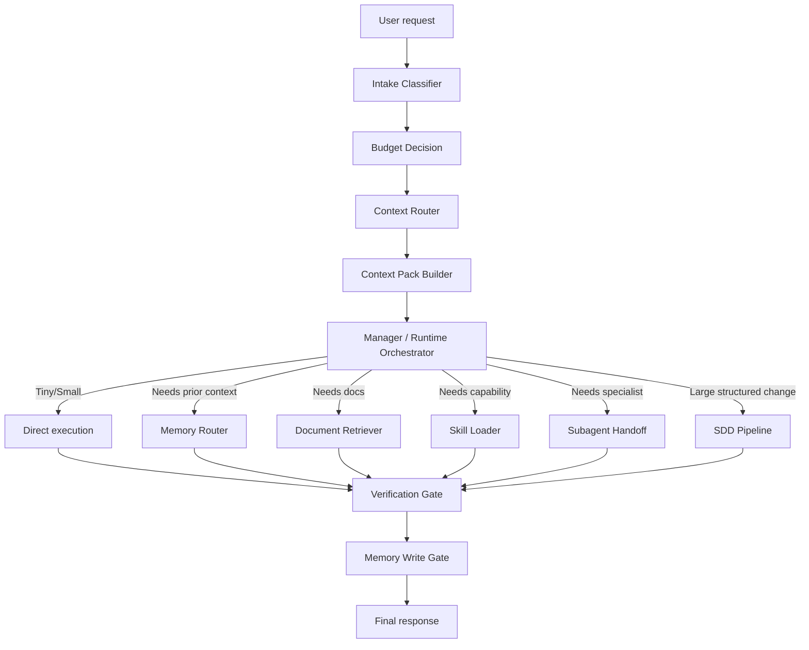

# Codex-First Memory and Token Architecture Proposal

**Date:** 2026-06-18  
**Repository:** `proyecto-opencode-mem`  
**Source architecture reviewed:** `<LOCAL_OPENCODE_ARCHITECTURE_REPO>`  
**Primary target:** Codex first  
**Secondary target:** OpenCode after Codex architecture is stable  
**Status:** Proposal for implementation

---

## 1. Executive summary

The current architecture is already pointing in the right direction: one Manager, SDD subagents, Engram governance, Noise Gate, context packs, and token reduction by lazy loading. The problem is not the idea. The problem is that the strongest parts still live as documentation/templates, while Codex needs an update-safe runtime overlay with enforceable checks.

The recommended architecture is a **Codex Runtime Orchestrator**: a thin Manager layer installed into user-owned Codex surfaces, backed by repo-managed skills, scripts, memory governance, and validation harnesses. OpenCode should come later through the same package model, never by modifying `<OPENCODE_APP_INSTALL_DIR>` directly.

Beginner version: today you have good blueprints. The next step is to turn the blueprints into a safe toolbox Codex can actually use every day.

Senior version: split policy, retrieval, execution, and persistence into bounded layers; move long instructions out of always-on context; retrieve only evidence-ranked context packs; persist only validated memory; and verify the installation with deterministic scripts.

---

## 2. Refined product request

Build a portable runtime kit that improves how Codex thinks, remembers, delegates, and spends tokens. It must:

1. Keep the Manager as the single primary orchestrator.
2. Make Codex the first supported runtime.
3. Preserve OpenCode compatibility without touching update-managed binaries.
4. Make memory useful, scoped, deduplicated, redactable, and measurable.
5. Reduce token waste by loading docs, skills, tools, and memories only when justified.
6. Provide scripts that install, validate, back up, roll back, and report token/memory quality.
7. Provide beginner-friendly docs and senior-grade architecture contracts.
8. Be replicable for other users from this repository.

---

## 3. Evidence reviewed

### Local evidence

- `<LOCAL_OPENCODE_ARCHITECTURE_REPO>\README.md`
- `<LOCAL_OPENCODE_ARCHITECTURE_REPO>\docs\opencode-architecture\10-target-architecture.md`
- `<LOCAL_OPENCODE_ARCHITECTURE_REPO>\docs\opencode-architecture\11-memory-and-token-optimization-model.md`
- `<LOCAL_OPENCODE_ARCHITECTURE_REPO>\docs\opencode-architecture\16-memory-governance-policy.md`
- `<LOCAL_OPENCODE_ARCHITECTURE_REPO>\docs\opencode-architecture\19-context-pack-contract.md`
- `<LOCAL_OPENCODE_ARCHITECTURE_REPO>\docs\opencode-architecture\20-memory-writer-validator-contract.md`
- `<LOCAL_OPENCODE_ARCHITECTURE_REPO>\docs\opencode-architecture\24-noise-gate-design.md`
- `<LOCAL_RUNTIME_KIT_REPO>\opencode-kit.manifest.json`
- `<LOCAL_RUNTIME_KIT_REPO>\templates\AGENTS.example.md`
- `<LOCAL_RUNTIME_KIT_REPO>\plugins\engram.template.ts`

### External references

- OpenAI Codex `AGENTS.md`: https://developers.openai.com/codex/guides/agents-md
- OpenAI Codex memories: https://developers.openai.com/codex/memories
- OpenAI Codex skills: https://developers.openai.com/codex/skills
- OpenAI Agents SDK agents: https://openai.github.io/openai-agents-python/agents/
- OpenAI Agents SDK handoffs: https://openai.github.io/openai-agents-python/handoffs/
- LangGraph memory concepts: https://docs.langchain.com/oss/python/concepts/memory
- LangGraph persistence: https://docs.langchain.com/oss/python/langgraph/persistence
- Letta archival memory: https://docs.letta.com/guides/core-concepts/memory/archival-memory/
- Letta stateful agents: https://docs.letta.com/guides/core-concepts/stateful-agents/
- Zep Graphiti: https://github.com/getzep/graphiti
- Zep paper: https://arxiv.org/html/2501.13956v1
- Mem0 docs: https://docs.mem0.ai/introduction
- Mem0 paper: https://arxiv.org/abs/2504.19413

---

## 4. Current model vs target model

| Area | Current model | Gap | Target model |
|---|---|---|---|
| Primary orchestrator | Manager is documented as unique primary | In Codex it is still mostly instruction-level | Codex Runtime Orchestrator installed as user/project overlay |
| SDD | Templates exist | Runtime enforcement is partial | SDD launcher contract + phase envelopes + validation script |
| Memory | Engram guidance + Codex memories exist | No unified quality score across memory layers | Memory router with scoring, dedupe, TTL, sensitivity, evidence |
| Tokens | Fase F strategy exists | Not enforced in Codex workflow | Context Pack Builder with budgets per request type |
| Skills | Lazy loading is conceptually aligned | No project skill registry in `proyecto-opencode-mem` | Generated `skill-registry.md` + validation |
| Subagents | Templates exist | Delegation rules not packaged as Codex-first runtime | Orchestrator delegation matrix + compact envelopes |
| Security | Sanitizer exists | Codex overlay safety is not fully specified | Install-safe overlay, backup, rollback, secret scan, no binary edits |
| QA | Tests exist for kit | Need Codex-specific install/runtime smoke | Codex doctor + context pack tests + memory lint |
| Portability | Manifest profiles exist | Paths still a core warning from source architecture | Variable-based paths and profile resolver |

---

## 5. Recommended architecture

### 5.1 Name

Use **Codex Runtime Orchestrator** as the formal name, with **Manager** as the user-facing shorthand.

Why: “Manager” is clear for humans, but “Runtime Orchestrator” explains the real responsibility: route, budget, retrieve, delegate, validate, and synthesize.

### 5.2 Layered architecture



### 5.3 Runtime surfaces

| Surface | Purpose | Install target | Update safety |
|---|---|---|---|
| Global Codex instructions | Minimal Manager contract | `<CODEX_HOME>\AGENTS.md` or included overlay file | User-owned, back up before write |
| Codex skills | Lazy-loaded deep protocols | `<CODEX_HOME>\skills\opencode-runtime-kit\...` | User-owned, versioned by kit |
| Project AGENTS | Project-specific contract | repo root `AGENTS.md` where user chooses | Repo-owned |
| Docs | Architecture source of truth | `docs/` in this repo | Git versioned |
| Scripts | Install/doctor/rollback/token reports | `scripts/` in this repo | Git versioned |
| OpenCode runtime | Later integration | user config only, not app binary dir | Do not modify `<OPENCODE_APP_INSTALL_DIR>` |

---

## 6. Memory architecture

### 6.1 Memory layers

| Layer | Example | Use | Anti-pattern |
|---|---|---|---|
| L0 active context | Current turn | Immediate reasoning | Stuffing old docs into prompt |
| L1 explicit contract | `AGENTS.md` | Stable rules | Turning it into a knowledge dump |
| L2 Codex local memories | Codex-generated memory files | Learned local context | Treating them as formal ADRs |
| L3 Engram observations | Decisions, bugs, patterns | Cross-session semantic retrieval | Saving prompts/logs/code |
| L4 Markdown/ADRs | Versioned architecture | Source of truth | Loading all docs every turn |
| L5 Skill registry | Skill names/triggers/paths | Capability discovery | Replacing docs or memory |
| L6 External memory engines | Mem0/Zep/Letta later | Advanced retrieval experiments | Adding infra before governance works |

### 6.2 Retrieval scoring

Use a simple score before injecting any memory:

```text
score =
  0.35 * semantic_relevance +
  0.20 * scope_match +
  0.15 * evidence_quality +
  0.10 * recency_fit +
  0.10 * authority +
  0.10 * reuse_frequency -
  0.20 * sensitivity_risk -
  0.10 * token_cost
```

Inject only items above threshold. Default threshold: `0.65`. Hard block if sensitivity is high.

### 6.3 Write gate

Save memory only when one of these is true:

- architecture/design decision was made;
- bug root cause was found;
- non-obvious project discovery happened;
- user preference was learned;
- reusable pattern was established;
- configuration or runtime setup changed;
- SDD artifact reached a meaningful phase boundary.

Do not save:

- raw prompts;
- transient command output;
- full logs;
- source code;
- secrets;
- unvalidated hypotheses;
- duplicate memories with different wording.

### 6.4 Memory analogy for beginners

Think of the system like a workshop:

- `AGENTS.md` is the safety poster on the wall.
- Markdown docs are the construction plans.
- Engram is the notebook of lessons learned.
- Skills are specialized tools in drawers.
- Context Pack is the small tray of tools you bring to the bench for this specific job.

The mistake is carrying the whole workshop in your arms every time. The goal is to bring only the right tray.

---

## 7. Token optimization architecture

### 7.1 Request classes and budgets

| Request type | Retrieval | Delegation | Target context strategy |
|---|---|---|---|
| Tiny | none | none | answer directly |
| Small | local files only | no | read 1-3 files max |
| Memory | mem_context then mem_search | no unless broad | max 3 memories |
| Docs | targeted markdown sections | no unless 4+ files | max 3 sections |
| Code multi-file | targeted map first | yes if 2+ non-trivial files | subagent context pack |
| SDD | artifact references, not full artifact dumps | yes | phase-specific pack |
| Research | browser/source pack | maybe | source summaries + links |
| Security/QA | evidence-first | fresh reviewer | strict checklist |

### 7.2 Token rules

1. Stable instructions should be short and cache-friendly.
2. Large docs should live in files and be read by route, not injected by default.
3. Skills should be lazy-loaded by trigger.
4. MCP/tool schemas should be activated only when the task requires them.
5. Subagents should receive artifact references and exact paths, not a wall of prose.
6. Every context pack should declare why each item is included.
7. If an item has no reason, it does not enter context.

### 7.3 Context Pack schema

```json
{
  "request_id": "YYYYMMDD-HHMM-topic",
  "classification": "tiny|small|memory|docs|code|sdd|research|security|qa",
  "token_budget": 3000,
  "included": [
    {
      "kind": "memory|doc|file|skill|source|artifact",
      "ref": "path-or-id-or-url",
      "reason": "why this is necessary",
      "max_words": 180,
      "sensitivity": "low|medium|high"
    }
  ],
  "excluded": [
    {
      "ref": "path-or-id-or-url",
      "reason": "too broad|not relevant|sensitive|duplicate"
    }
  ]
}
```

---

## 8. Required scripts

Create these scripts in future phases:

| Script | Purpose | Why it matters |
|---|---|---|
| `scripts/install-codex-overlay.mjs` | Install Codex-first Manager/skills/templates into user-owned `.codex` paths | Codex first, update-safe |
| `scripts/codex-doctor.mjs` | Verify Codex overlay, skill paths, AGENTS size, memory config | Prevent silent broken installs |
| `scripts/context-pack-check.mjs` | Validate context pack JSON and budgets | Token discipline becomes testable |
| `scripts/memory-lint.mjs` | Detect raw prompts, secrets, duplicates, missing evidence | Keeps memory from becoming garbage |
| `scripts/token-budget-report.mjs` | Estimate fixed/dynamic context costs from docs/config | Makes optimization measurable |
| `scripts/skill-registry-generate.mjs` | Generate project skill registry from skill dirs | Fixes current missing registry gap |
| `scripts/install-opencode-overlay.mjs` | Later: install OpenCode config overlay only | Avoid modifying Electron app install |
| `scripts/rollback-overlay.mjs` | Restore backups from last install | Safety and trust |

---

## 9. Required skills

Create repo-managed skills under `skills/` and install them into Codex via overlay:

| Skill | Trigger | Responsibility |
|---|---|---|
| `manager-router` | any non-trivial request | classify, route, budget, decide delegation |
| `memory-governance` | remember/recall/session/project history | retrieve/write/update memory safely |
| `context-pack-builder` | broad repo work, SDD, research | build minimal context packs |
| `token-budgeter` | optimization, large docs, many skills | estimate and reduce token footprint |
| `codex-overlay-installer` | install/update/rollback Codex runtime kit | safe local installation |
| `sdd-orchestrator` | `/sdd-*` or structured change | coordinate SDD phases |
| `qa-verification-gate` | before completion | verify evidence against requirements |
| `security-sanitizer` | install/export/memory work | block secrets and unsafe paths |
| `beginner-explainer` | docs/tutorial requests | explain architecture simply without changing artifacts |

---

## 10. Required agents/subagents

| Agent | Type | When Manager calls it | Output |
|---|---|---|---|
| `context-scout` | explorer | 4+ files need mapping | file map + evidence |
| `memory-curator` | specialist | memory quality/dedupe/TTL work | memory audit + fixes proposed |
| `token-auditor` | specialist | token budget reports | fixed/dynamic cost report |
| `sdd-phase-agent` | phase executor | each SDD phase | `SUBAGENT_RESULT` |
| `security-auditor` | fresh reviewer | install/export/secrets | risk report |
| `qa-verifier` | fresh reviewer | before done/PR/release | requirement evidence matrix |
| `docs-architect` | writer | beginner/senior docs | docs patch |

Subagents must not become managers. The Manager owns orchestration. Subagents own bounded work.

---

## 11. Security model

1. Never modify `<OPENCODE_APP_INSTALL_DIR>`.
2. Always install to user-owned overlays or repo-owned files.
3. Back up before writing to `.codex` or OpenCode config.
4. Store real memory DBs outside the repo.
5. Redact secrets before memory capture.
6. Block export of DBs, logs, `.env`, tokens, absolute personal paths.
7. Validate all generated files with sanitizer.
8. Provide rollback for every installer.
9. Keep third-party memory engines optional until local governance is proven.

---

## 12. QA model

Every phase must have a proof command:

| Phase | Proof |
|---|---|
| Proposal | docs exist and link to sources |
| Codex overlay install | dry-run + temp install pass |
| Skill registry | generated registry has expected skills |
| Context pack | fixture packs validate and reject over-budget packs |
| Memory lint | fixtures catch secrets/noise/duplicates |
| Token report | fixed-context estimate produced |
| OpenCode overlay | dry-run proves no binary path writes |
| Release | `pnpm test:all` + sanitizer + docs check |

---

## 13. Implementation roadmap

### Phase 1 — Codex architecture hardening

- Add Codex-specific docs.
- Add `codex` and `codex-full` profiles to manifest.
- Generate a project skill registry.
- Add context pack and memory lint contracts.
- Add token budget report baseline.

### Phase 2 — Codex overlay installer

- Implement dry-run installer.
- Add backup/rollback.
- Install Manager/skills to `.codex` user-owned paths.
- Add Codex doctor.

### Phase 3 — Runtime governance enforcement

- Enforce context pack budget checks.
- Add memory write validator.
- Add secret/noise fixtures.
- Add QA completion matrix.

### Phase 4 — OpenCode adaptation

- Implement OpenCode overlay installer.
- Write only to user config paths.
- Never touch `<OPENCODE_APP_INSTALL_DIR>`.
- Port proven Codex contracts.

### Phase 5 — Optional advanced memory engines

Evaluate Mem0, Zep/Graphiti, Letta, or LangGraph-style stores only after local governance works. The order matters. If you add a powerful memory engine before quality gates, you only build a more expensive garbage collector.

---

## 14. Critical comparison with external architectures

| External pattern | Useful idea | What to adopt | What not to adopt yet |
|---|---|---|---|
| Codex AGENTS.md | layered explicit instructions | global/project overlays | huge always-on instruction dumps |
| Codex memories | background local memory files | autonomous local learning | treating memory as formal source of truth |
| Codex skills | lazy-load full instructions | small skills with exact triggers | installing too many broad skills |
| Agents SDK handoffs | specialist delegation | Manager-owned subagent routing | peer managers competing |
| LangGraph | checkpoint vs long-term store separation | distinguish session state from durable memory | importing graph runtime prematurely |
| Letta | self-editing/stateful memory | memory tools and archival separation | uncontrolled self-editing without validator |
| Zep/Graphiti | temporal knowledge graph | future relationship memory for multi-hop questions | graph DB before local quality metrics |
| Mem0 | extraction/consolidation/retrieval loop | memory scoring and cost reduction goals | external dependency as Phase 1 requirement |

---

## 15. Success criteria

The proposal becomes successful when:

1. A new user can clone the repo and run a dry-run Codex install.
2. No private paths/secrets are exported.
3. Codex can load a small Manager contract and lazy-load deeper skills.
4. Context packs are generated and validated.
5. Memory writes are classified, deduped, and evidence-linked.
6. Token budget reports show fixed context has been reduced or at least measured.
7. OpenCode support is implemented as an overlay, not by editing app binaries.
8. Beginner docs explain the system without requiring agent architecture knowledge.
9. Senior docs expose contracts, risks, metrics, and rollback.

---

## 16. Hard recommendation

Do **not** start by installing Mem0, Zep, Letta, or a graph database. That is tempting, but it is backwards. First make Codex disciplined with local contracts: Manager, context packs, memory lint, skill registry, and token reports. Then, when the local memory quality is measurable, evaluate external memory engines with real fixtures.

Architecture is like construction: no tiene sentido comprar una grúa si todavía no marcaste los cimientos. Primero cimientos, después maquinaria.

