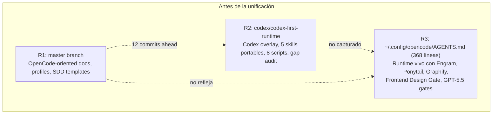

# Plan de Unificación Arquitectónica

> **Propósito**: Unificar `proyecto-opencode-mem` en una sola arquitectura que sirva a OpenCode y Codex como runtimes destino, con contratos portables compartidos y adaptadores runtime-specific.
>
> **Branch de trabajo**: `unified-architecture` (derivada de `codex/codex-first-runtime`, que contiene ~12 commits adicionales sobre `master`)
>
> **Repositorio**: `harrysxavio/proyecto-opencode-mem`
>
> **Última actualización**: 2026-06-18
>
> **Documentos de avance**: `docs/plan-unificacion/AVANCE-FASE-*.md`

---

## 1. Diagnóstico: El Problema Real

### 1.1 Las tres realidades divergentes



| Realidad | Ubicación | Estado | Contenido clave |
|----------|-----------|--------|-----------------|
| **R1: Master original** | `master` branch | ✅ Tests pasan, docs-check ok | OpenCode-oriented: README.md (565 líneas), docs/, profiles, SDD templates, scripts compartidos |
| **R2: Codex-first branch** | `codex/codex-first-runtime` | ⚠️ 12 commits ahead de master | Codex overlay, 5 skills portables (noise-gate, token-budgeter, context-pack-builder, etc.), 8 scripts (install, rollback, doctor, memory-lint, etc.), gap audit, tests Codex |
| **R3: OpenCode runtime vivo** | `~/.config/opencode/AGENTS.md` | 🟢 Funcionando | 368 líneas con: Manager protocol completo, Engram auto-triggers, Ponytail "Never simplify away", Frontend Design Gate, Graphify Context Gate, GPT-5.5 review, Fast-Track exceptions |

### 1.2 La brecha fundamental

**R1** (master) tiene perfiles y documentación que R3 (runtime) no usa directamente.  
**R2** (branch) tiene skills y scripts que R1 no tiene.  
**R3** (runtime) tiene protocolos que NI R1 ni R2 capturan como templates portables.

**El resultado**: tres fuentes de verdad, todas incompletas. Cada vez que se actualiza el runtime, la brecha crece. Cada vez que se avanza en la branch, la divergencia con master aumenta.

### 1.3 Por qué esto es insostenible

1. **Costo de mantenimiento**: mantener dos ramas = ~2x esfuerzo en cada cambio
2. **Riesgo de divergencia**: cada semana que pasa, las ramas se parecen menos (merge conflicts crecientes)
3. **Conocimiento perdido**: el runtime R3 tiene decisiones arquitectónicas que no están documentadas como templates
4. **Fricción para nuevos usuarios**: ¿qué rama clono? ¿master o codex? ¿cuál es la oficial?

---

## 2. Análisis Multidimensional

Antes de diseñar la solución, se analizó el problema desde 10 perspectivas diferentes para asegurar que ninguna dimensión quede sin considerar.

### 2.1 Perspectiva Técnica

**Observación**: Las skills (SKILL.md con frontmatter) son inherentemente portables — funcionan en cualquier runtime que soporte lazy-loading por trigger. Los scripts de instalación son runtime-specific (Codex overlay copia a `<CODEX_HOME>`, OpenCode overlay copia a `~/.config/opencode/`). El Manager es el mismo diseño conceptual pero distinto nivel de detalle: OpenCode necesita uno detallado (~300+ líneas con gates), Codex necesita uno compacto (~80 líneas con lazy-loading).

**Decisión**: Skills portables compartidas en `skills/`. Scripts de instalación separados en `opencode/scripts/` y `codex/scripts/`. Templates de Manager separados en cada adaptador.

### 2.2 Perspectiva Arquitectura

**Observación**: El flujo central (Manager → Classify → Context Pack → Execute → Verify → Memory → Respond) es runtime-agnostic. Las diferencias son gates: Graphify, Frontend Design, GPT-5.5 existen solo en OpenCode porque dependen de su ecosistema de subagentes y MCPs.

**Decisión**: Un ARCHITECTURE.md compartido con secciones "Runtime Adaptations" que documentan qué aplica a cada runtime.

### 2.3 Perspectiva Memoria

**Observación**: OpenCode usa Engram MCP con mem_save/mem_search/mem_context. Codex tiene su sistema nativo de "memories" (SQLite local). Ambos necesitan las mismas reglas: Noise Gate antes de guardar, Memory Governance para calidad, Memory Lint para validación.

**Decisión**: Las *reglas* de memoria son compartidas y van en `contracts/`. La *implementación* (API calls) es runtime-specific.

### 2.4 Perspectiva Seguridad

**Observación**: Ambos runtimes comparten el mismo modelo de seguridad: overlay de usuario (no modificar binarios), backup antes de escribir, rollback obligatorio, sanitizer para evitar secretos en el repo.

**Decisión**: Seguridad como shared contract en `contracts/`. Implementación de instalación/backup/rollback separada en cada runtime adapter.

### 2.5 Perspectiva Usuario

**Observación**: Un usuario de OpenCode necesita "elegir perfil → copiar templates → validar". Un usuario de Codex necesita "ejecutar overlay installer → correr doctor → usar". Son caminos distintos que comparten un 30% de la documentación.

**Decisión**: README.md unificado como entry point + QUICKSTART_OPENCODE.md + QUICKSTART_CODEX.md con guías independientes de 5 pasos.

### 2.6 Perspectiva Frontend

**Observación**: El Frontend Design Gate (design-md + frontend-design + canvas-design + web-design-guidelines) es dependiente del subagent `frontend-specialist` de OpenCode. Codex no tiene ese ecosistema de subagentes. Sin embargo, las skills individuales (web-design-guidelines, flow-diagram) son portables.

**Decisión**: Skills portables en `skills/`. Frontend Design Gate como orquestación específica de OpenCode en `opencode/gates/frontend-design.md`.

### 2.7 Perspectiva Gerencia

**Observación**: Un solo repositorio con dos ramas divergentes es un antipatrón de gestión. Cada día de divergencia aumenta el costo de la reconciliación. El merge debe ser inmediato.

**Decisión**: Merge now. La reestructuración se hace post-merge en la branch `unified-architecture`.

### 2.8 Perspectiva QA

**Observación**: Los tests actuales (12 unitarios pasando) solo cubren el perfil OpenCode y los scripts compartidos. Los tests de la branch (9 adicionales) cubren el overlay Codex. No hay tests que validen los contratos compartidos ni los gates.

**Decisión**: Tests reorganizados en `tests/shared/`, `tests/opencode/`, `tests/codex/` con CI que corre los tres grupos.

### 2.9 Perspectiva Código Senior

**Observación**: La regla fundamental para evitar duplicación es: "un concepto = un archivo". Las skills portables no deben duplicarse entre runtimes. Los templates de Manager deben ser parametricos.

**Decisión**: Una skill = un SKILL.md en `skills/`. Templates de Manager separados porque reflejan runtimes distintos. Scripts base compartidos en `scripts/` (validate, sanitize, manifest-utils).

### 2.10 Perspectiva Estructural

**Observación**: El directorio actual es plano y mezcla lo compartido con lo runtime-specific. No hay una separación clara de zonas.

**Decisión**: Tres zonas claras:
1. `contracts/` + `skills/` + `scripts/` + `tests/shared/` = **Shared**
2. `opencode/` + `docs/opencode/` + `tests/opencode/` = **OpenCode Adapter**
3. `codex/` + `docs/codex/` + `tests/codex/` = **Codex Adapter**

---

## 3. Arquitectura Destino

### 3.1 Diagrama de capas

```
proyecto-opencode-mem/               ← Runtime Kit
│
├── ARCHITECTURE.md                   ← Fuente única de verdad arquitectónica
├── README.md                         ← Entry point unificado para humanos
├── QUICKSTART_OPENCODE.md            ← 5 pasos: OpenCode
├── QUICKSTART_CODEX.md               ← 5 pasos: Codex
├── opencode-kit.manifest.json        ← Catálogo de componentes y perfiles
│
├── contracts/                        ← 7 contratos portables (runtime-agnostic)
│   ├── manager.md                    ←   Qué hace un Manager
│   ├── sdd-pipeline.md               ←   Qué son las fases SDD
│   ├── memory-governance.md          ←   Reglas de memoria
│   ├── noise-gate.md                 ←   Clasificación de ruido
│   ├── token-discipline.md           ←   Disciplina de tokens
│   ├── context-pack-schema.md        ←   Schema de context packs
│   └── ponytail.md                   ←   Principios de código mínimo
│
├── skills/                           ← Skills portables (16 skills)
│
├── opencode/                         ← Adaptador OpenCode
│   ├── manager.template.md           ←   Manager detallado ~200+ líneas
│   ├── gates/                        ←   Gates específicos OpenCode
│   ├── scripts/                      ←   Instalador, doctor
│   └── tests/
│
├── codex/                            ← Adaptador Codex
│   ├── manager.template.md           ←   Manager compacto ~80 líneas
│   ├── scripts/                      ←   Instalador, rollback, doctor, etc.
│   └── tests/
│
├── scripts/                          ← Scripts compartidos
├── templates/                        ← Templates compartidos
├── docs/                             ← Documentación
├── tests/                            ← Tests compartidos
└── .github/workflows/                ← CI para ambos runtimes
```

### 3.2 Principios arquitectónicos

1. **Shared over duplicated**: un concepto debe vivir en un solo lugar. Las skills portables son el ejemplo principal.
2. **Contract over implementation**: los contratos (`contracts/`) describen QUÉ. Los adaptadores (`opencode/`, `codex/`) describen CÓMO.
3. **Overlay safety**: ningún instalador modifica directorios administrados por actualizaciones de la app.
4. **Runtime parity**: ambos runtimes deben poder usar las mismas skills y contratos.
5. **Progressive disclosure**: un beginner debe poder usar el kit sin entender toda la arquitectura.

---

## 4. Fases de Implementación

### Fase 0 — Merge y Restructura Base

**Qué busca**: Unificar las dos ramas en una sola línea base con estructura clara de directorios.

**Por qué es primero**: Sin una base unificada, cualquier cambio posterior se haría sobre una estructura inconsistente. Es la fundación.

**Acciones detalladas**:
1. Crear branch `unified-architecture` desde `codex/codex-first-runtime` (contiene todo)
2. Crear directorios: `contracts/`, `opencode/`, `codex/`, `docs/opencode/`, `docs/codex/`, `docs/plan-unificacion/`
3. Editar imports de scripts que se moverán (cambiar rutas relativas)
4. `git mv` scripts Codex: `scripts/install-codex-overlay.mjs` → `codex/scripts/install-overlay.mjs` (y otros 7)
5. `git mv` scripts OpenCode: `scripts/install-opencode-overlay.mjs` → `opencode/scripts/install-overlay.mjs`
6. `git mv` tests Codex: de `tests/unit/` y `tests/integration/` a `codex/tests/`
7. `git mv` template Codex: `templates/codex/AGENTS.codex.example.md` → `codex/manager.template.md`
8. Eliminar `templates/codex/` (vacío después del move)
9. Actualizar imports en tests movidos
10. Actualizar `package.json` con scripts para ambos runtimes
11. Actualizar `opencode-kit.manifest.json` con nuevas rutas
12. Crear `ARCHITECTURE.md` (documento maestro)
13. Verificar: `pnpm test:all` + `pnpm validate` + `pnpm sanitize:check` + tests Codex
14. Commit y push

**Archivos creados**: ARCHITECTURE.md, directorios
**Archivos movidos**: ~10 scripts + ~9 tests + 1 template
**Archivos eliminados**: templates/codex/ (directorio vacío tras move)

**Criterio de éxito**: Todas las validaciones pasan. Tests Codex corren desde nueva ubicación. Estructura clara.

---

### Fase 1 — Contratos Portables (`contracts/`)

**Qué busca**: Extraer de la documentación actual los 7 contratos runtime-agnostic que describen QUÉ hace cada componente, no CÓMO se implementa.

**Por qué es segundo**: Los contratos son la base conceptual compartida. Sin ellos, cada runtime adapter inventaría su propia versión de las reglas.

**Acciones detalladas**:
1. Crear `contracts/manager.md` desde `docs/manager.md` + `agents/manager/manager.template.md` + AGENTS.md runtime
2. Crear `contracts/sdd-pipeline.md` desde `docs/sdd.md` + `agents/sdd/` templates
3. Crear `contracts/memory-governance.md` desde `docs/memory-governance.md` + `skills/memory-governance/SKILL.md` + AGENTS.md runtime (Engram protocol)
4. Crear `contracts/noise-gate.md` desde `skills/noise-gate/SKILL.md`
5. Crear `contracts/token-discipline.md` desde `skills/token-budgeter/SKILL.md`
6. Crear `contracts/context-pack-schema.md` desde `skills/context-pack-builder/SKILL.md`
7. Crear `contracts/ponytail.md` desde AGENTS.md runtime (Ponytail protocol, líneas 261-368)

**Reglas para cada contrato**:
- Descripción del QUÉ (runtime-agnostic)
- Sección "Runtime Adaptations" al final
- Máximo ~100 líneas
- Lenguaje: español (consistente con README actual)
- Referenciable desde ARCHITECTURE.md

**Criterio de éxito**: 7 archivos en `contracts/`, cada uno con sección "Runtime Adaptations", todos referenciados desde ARCHITECTURE.md.

---

### Fase 2 — Adaptador OpenCode

**Qué busca**: Capturar el AGENTS.md runtime real (368 líneas) como template portable + documentar los 3 gates específicos de OpenCode.

**Por qué es tercero**: OpenCode es el runtime primario del usuario. Su template debe reflejar fielmente lo que ya funciona.

**Componentes**:
- `opencode/manager.template.md`: Manager detallado que captura:
  - Manager Global Orchestration Protocol completo
  - Engram con auto-triggers (mem_save, mem_context, session_summary)
  - Ponytail con "Never simplify away" y Completion Contract
  - Frontend Design Skills Integration
  - Graphify Context Gate con sensitive data rule
  - GPT-5.5 OAuth quality gates
  - Fast-Track Exceptions
  - Default Behavior
- `opencode/gates/graphify-context.md`: Gate completo
- `opencode/gates/frontend-design.md`: Gate completo con las 4 skills de diseño
- `opencode/gates/gpt55-review.md`: Gate con criterios y fallback
- `opencode/scripts/install-overlay.mjs`: Instalador dry-run + real
- `opencode/scripts/doctor.mjs`: Doctor específico OpenCode
- `opencode/tests/`: Tests del template y scripts

**Criterio de éxito**: El template de Manager OpenCode refleja el AGENTS.md runtime real. Los gates están documentados. El instalador dry-run funciona.

---

### Fase 3 — Adaptador Codex

**Qué busca**: Consolidar lo que ya existe en la branch en `codex/` con documentación y tests.

**Por qué es cuarto**: Codex tiene más código existente (scripts, tests) que necesita ser organizado antes de crear contenido nuevo.

**Componentes**:
- `codex/manager.template.md`: Manager compacto (~80 líneas, ya existe)
- Scripts Codex movidos en Fase 0 con documentación
- `docs/codex/getting-started.md`: Guía de 5 pasos
- `docs/codex/overlay-install.md`: Documentación del instalador
- `docs/codex/troubleshooting.md`: Problemas comunes
- Tests Codex existentes + nuevos

**Criterio de éxito**: `pnpm codex:doctor`, `pnpm codex:install:dry-run`, `pnpm test:codex` funcionan.

---

### Fase 4 — README Unificado y Quickstarts

**Qué busca**: Un solo README.md que sirva a ambos runtimes + guías rápidas de 5 pasos + limpieza de documentos obsoletos (~15 archivos de Phase 0/1).

**Por qué es quinto**: README y docs son la cara del proyecto. Se hacen al final cuando la estructura ya está sólida.

**Acciones**:
1. Reescribir README.md como entry point único con secciones "Para usuarios de OpenCode" / "Para usuarios de Codex"
2. Crear QUICKSTART_OPENCODE.md (5 pasos)
3. Crear QUICKSTART_CODEX.md (5 pasos)
4. Mover docs obsoletos a `docs/archive/` o eliminarlos

**Documentos a eliminar/archivar**:

| Archivo | Decisión | Por qué |
|---------|----------|---------|
| `README_CODEX.md` | ❌ Eliminar | Contenido absorbido en ARCHITECTURE.md + docs/codex/ |
| `docs/codex-runtime.md` | ❌ Eliminar | Absorbido en contracts/ |
| `docs/codex-opencode-gap-audit.md` | ❌ Eliminar | Cumplió propósito, ahora es ARCHITECTURE.md |
| `docs/opencode-adaptation.md` | ❌ Eliminar | Ya no hay "adaptación", es nativo |
| `docs/profiles.md` | ❌ Eliminar | Absorbido en README.md + quickstarts |
| `docs/BOOTSTRAP-PRECHECK.md` | 📦 Archivar | Cumplió propósito Phase 0 |
| `docs/BOOTSTRAP-REPORT.md` | 📦 Archivar | Cumplió propósito Phase 0 |
| `docs/PHASE-1-DOCUMENTATION-AUDIT.md` | 📦 Archivar | Cumplió propósito |
| `docs/PHASE-1-INSTALL-UX-REPORT.md` | 📦 Archivar | Cumplió propósito |
| `docs/PHASE-1.1-DOCUMENTATION-ACCURACY-AUDIT.md` | 📦 Archivar | Cumplió propósito |
| `docs/superpowers/plans/*` | 📦 Archivar | Planes de implementación pasados |
| `docs/phase-roadmap.md` | ❌ Eliminar | Reemplazado por este plan |
| `docs/proposals/2026-06-18-*` | 📦 Archivar | Propuesta ya implementada |
| `docs/phase-2/*` | 📦 Archivar | Fase 2 replanteada en este plan |
| `agents/` | ❌ Eliminar | Reemplazado por `opencode/manager.template.md` + `contracts/sdd-pipeline.md` |
| `plugins/` | ❌ Eliminar | Engram template movido a `opencode/` |
| `examples/` | ❌ Eliminar | READMEs vacíos sin contenido real |

**Criterio de éxito**: docs-check pasa con las nuevas rutas. README.md unificado. Quickstarts funcionales.

---

### Fase 5 — Tests y CI

**Qué busca**: Cobertura de tests para ambos runtimes + CI que valide ambos.

**Acciones**:
- Reorganizar tests existentes en `tests/shared/`, `tests/opencode/`, `tests/codex/`
- Tests de contratos: verificar que existen y tienen sección "Runtime Adaptations"
- Tests de templates OpenCode y Codex
- Tests de skills: frontmatter válido (name, description, trigger)
- CI workflow actualizado para correr los 3 grupos

**Criterio de éxito**: `pnpm test:opencode` y `pnpm test:codex` funcionan. CI reporta estado por runtime.

---

### Fase 6 — Limpieza Final y Release

**Qué busca**: Cero archivos obsoletos, cero warnings, release con tag.

**Acciones**:
1. Eliminar archivos marcados como "Eliminar" en Fase 4
2. Mover archivos "Archivar" a `docs/archive/`
3. Verificar validaciones post-limpieza
4. Actualizar CHANGELOG.md
5. Commit final con mensaje `feat: unified architecture for OpenCode + Codex`
6. Tag v0.2.0

**Criterio de éxito**: Todas las validaciones pasan. CHANGELOG actualizado. Tag creado.

---

## 5. Línea de Tiempo Estimada

| Fase | Depende de | Esfuerzo estimado | Archivos tocados |
|------|-----------|-------------------|------------------|
| 0 | Nada | ~100 operaciones | ~30 archivos |
| 1 | Fase 0 | ~7 contratos | ~7 archivos + ARCHITECTURE.md |
| 2 | Fase 1 | ~7 archivos adapter | ~7 archivos |
| 3 | Fase 0 | ~4 docs + tests | ~7 archivos |
| 4 | Fases 0-3 | ~20 archivos | ~25 archivos |
| 5 | Fases 0-4 | ~5 tests | ~10 archivos |
| 6 | Fase 5 | ~15 eliminaciones | ~20 archivos |

---

## 6. Decisiones Arquitectónicas Registradas (ADRs)

### D-001: Skills portables compartidas
- **Status**: Aceptada
- **Contexto**: Las skills (SKILL.md) son archivos de texto con frontmatter. No dependen del runtime.
- **Decisión**: Viven en `skills/` y ambos runtimes las referencian. No se duplican.
- **Consecuencias**: Si una skill necesita lógica runtime-specific, se divide en skill portable + adapter.

### D-002: OpenCode Manager template refleja el runtime real
- **Status**: Aceptada
- **Contexto**: El AGENTS.md runtime (368 líneas) tiene protocolos que no están capturados como template portable.
- **Decisión**: `opencode/manager.template.md` debe ser un superconjunto del runtime real, no una versión simplificada.
- **Consecuencias**: El template será extenso (~200+ líneas) pero fiel al comportamiento real.

### D-003: Codex Manager template es compacto
- **Status**: Aceptada
- **Contexto**: Codex no tiene gates (Graphify, Frontend Design, GPT-5.5). Su overlay es más simple.
- **Decisión**: `codex/manager.template.md` es compacto (~80 líneas) con lazy-loading de skills.
- **Consecuencias**: El Manager de Codex no incluye protocolos que su runtime no soporta.

### D-004: No migrar plugins TypeScript entre runtimes
- **Status**: Aceptada
- **Contexto**: OpenCode tiene plugins TypeScript. Codex no tiene ese sistema de plugins.
- **Decisión**: Skills (SKILL.md) son portables. Plugins TypeScript no se migran.
- **Consecuencias**: Cada runtime mantiene sus propios plugins. Solo los contratos y skills se comparten.

### D-005: No forzar Engram en Codex
- **Status**: Aceptada
- **Contexto**: Codex tiene sistema nativo de "memories" (SQLite local).
- **Decisión**: Las reglas de memoria (Noise Gate, Memory Governance) son compartidas en `contracts/`. La implementación (API calls) es runtime-specific.
- **Consecuencias**: Los contratos de memoria son iguales. Las funciones diffieren (mem_save vs Codex memories API).

### D-006: No agregar dependencias externas (Mem0, Zep, LangGraph)
- **Status**: Aceptada
- **Contexto**: Hay propuestas para usar memoria externa (Mem0, Zep/Graphiti, Letta).
- **Decisión**: "Primero cimientos, después maquinaria." Solo después de que los contratos locales estén probados.
- **Consecuencias**: El plan no incluye integración con sistemas externos de memoria.

### D-007: Overlay update-safe
- **Status**: Aceptada
- **Contexto**: Los instaladores NO deben modificar directorios administrados por actualizaciones de las apps.
- **Decisión**: Todos los instaladores usan overlays de usuario. Backup antes de escribir. Rollback disponible.
- **Consecuencias**: La instalación es segura ante actualizaciones de OpenCode o Codex.

### D-008: Una rama como fuente única
- **Status**: Aceptada
- **Contexto**: Actualmente hay dos ramas divergentes (master, codex/codex-first-runtime).
- **Decisión**: `unified-architecture` es la rama de trabajo. Después de validación, se fusiona a master.
- **Consecuencias**: Se elimina la divergencia. master vuelve a ser la fuente única.

---

## 7. Lo que NO se hace (y por qué)

| No hacer | Razón |
|----------|-------|
| ❌ Escribir el AGENTS.md de OpenCode real desde cero | Ya existe y funciona (368 líneas). El repo debe tener un TEMPLATE que lo refleje. |
| ❌ Hacer que Codex use Engram | Codex tiene su propio sistema de memorias. Forzar Engram sería contraproducente. |
| ❌ Migrar plugins TypeScript de OpenCode a Codex | Los runtimes son distintos. Skills portables sí; plugins no. |
| ❌ Instalador automático que modifique el runtime de OpenCode | Ya está documentado: el kit es overlay, no installer automático. |
| ❌ Agregar dependencias externas (Mem0, Zep, LangGraph) | "Primero cimientos, después maquinaria." |
| ❌ Reescribir toda la documentación en inglés | El usuario usa español. Los contratos pueden ser bilingües si necesario. |
| ❌ Eliminar sin verificar impacto | Cada archivo a eliminar se analiza: ¿algo lo referencia? ¿rompe algo? |

---

## 8. Glosario del Plan

| Término | Significado |
|---------|-------------|
| **Contrato portable** | Documento en `contracts/` que describe QUÉ hace un componente sin especificar el runtime |
| **Runtime adapter** | Implementación concreta en `opencode/` o `codex/` |
| **Overlay** | Instalación que copia archivos a directorios de usuario (nunca app directories) |
| **Gate** | Quality gate específico de OpenCode (Graphify, Frontend Design, GPT-5.5) |
| **Skill portable** | SKILL.md con frontmatter que funciona en cualquier runtime que soporte lazy-loading |
| **ADRs** | Architecture Decision Records — decisiones registradas con contexto y consecuencias |
| **git mv** | Git move que preserva el historial de cambios del archivo |

---

## 9. Estado Actual

| Fase | Estado | Inicio | Fin |
|------|--------|--------|-----|
| 0 | 🔄 En ejecución | 2026-06-18 | — |
| 1 | 🔜 Pendiente | — | — |
| 2 | 🔜 Pendiente | — | — |
| 3 | 🔜 Pendiente | — | — |
| 4 | 🔜 Pendiente | — | — |
| 5 | 🔜 Pendiente | — | — |
| 6 | 🔜 Pendiente | — | — |
